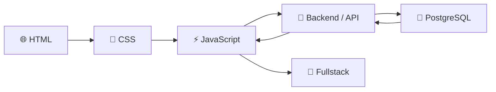
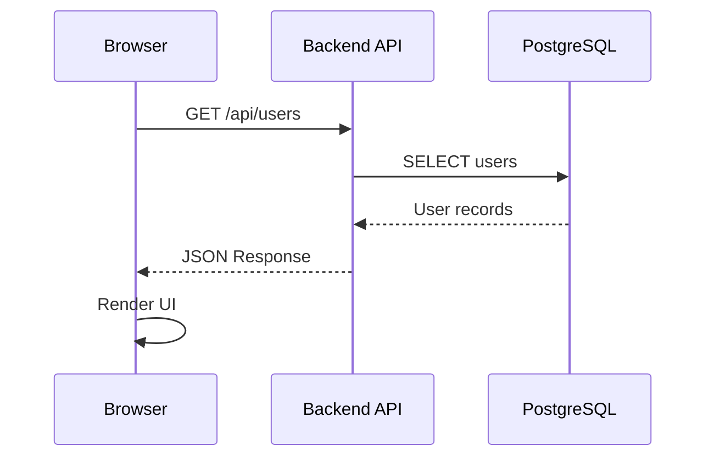
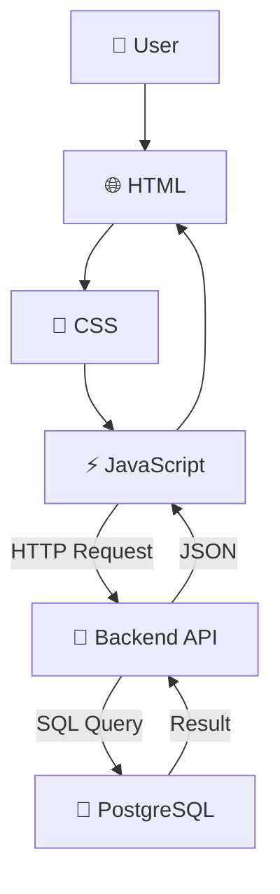

# 🌐 HTML • CSS • JavaScript • PostgreSQL

> 🚀 **A hands-on journey to mastering Web Development — from pixels to databases.**

<p align="center">
  <strong>Learn → Build → Break → Debug → Improve → Repeat 🔥</strong>
</p>

<p align="center">
  
  
  
  
</p>

<p align="center">
  
  
  
</p>

---

## 🧭 The Mission

This repository is a **hands-on playground for learning web development from the ground up**.

The goal isn't just to memorize syntax.

The goal is to understand:

```text
How does a browser work?
        ↓
How does HTML build a page?
        ↓
How does CSS make it beautiful?
        ↓
How does JavaScript make it alive?
        ↓
How does data travel to a server?
        ↓
How is that data stored?
        ↓
How does PostgreSQL bring it back?
        ↓
🔥 How do all of them work together?
```

---

## 🗺️ Learning Roadmap



### 📊 Progress

| Technology               | Level                   | Progress |
| ------------------------ | ----------------------- | -------: |
| 🌐 HTML                  | Beginner → Intermediate | 🟩🟩🟩⬜⬜ |
| 🎨 CSS                   | Beginner → Intermediate | 🟩🟩🟩⬜⬜ |
| ⚡ JavaScript             | Beginner → Intermediate |  🟩🟩⬜⬜⬜ |
| 🔌 API                   | Beginner                |   🟩⬜⬜⬜⬜ |
| 🐘 PostgreSQL            | Beginner                |  🟩🟩⬜⬜⬜ |
| 🚀 Fullstack Integration | Beginner                |   🟩⬜⬜⬜⬜ |

> Progress is intentionally imperfect.
> **The point is to keep moving.**

---

# 🌐 01 — HTML

HTML is where everything starts.

It describes the **structure and meaning** of a webpage.

```html
<!DOCTYPE html>
<html lang="en">
<head>
    <meta charset="UTF-8">
    <meta name="viewport" content="width=device-width, initial-scale=1.0">

    <title>My Website</title>
</head>

<body>

    <header>
        <h1>Hello World 👋</h1>
    </header>

    <main>
        <p>
            This page is built with HTML.
        </p>
    </main>

</body>
</html>
```

### 🧠 Topics

<details>
<summary>📚 HTML Fundamentals</summary>

* HTML document structure
* Semantic HTML
* Headings
* Paragraphs
* Links
* Images
* Lists
* Tables
* Forms
* Inputs
* Buttons
* Audio & Video
* Accessibility
* SEO fundamentals

</details>

<details>
<summary>🏗️ Semantic HTML</summary>

Instead of:

```html
<div class="header">
```

Prefer:

```html
<header>
```

Instead of:

```html
<div class="navigation">
```

Prefer:

```html
<nav>
```

Semantic HTML improves:

* Accessibility
* SEO
* Maintainability
* Code readability

</details>

---

# 🎨 02 — CSS

HTML gives the page **structure**.

CSS gives it **personality**.

```css
body {
    font-family: Arial, sans-serif;
    background: #f5f5f5;
}

.card {
    padding: 24px;
    border-radius: 12px;
}
```

### 🎯 Topics

<details>
<summary>📚 CSS Fundamentals</summary>

* Selectors
* Colors
* Typography
* Box Model
* Margin
* Padding
* Border
* Width & Height
* Position
* Display
* Flexbox
* Grid
* Pseudo classes
* Pseudo elements
* Transitions
* Animations

</details>

<details>
<summary>📱 Responsive Design</summary>

The goal:

```text
📱 Mobile
   ↓
💻 Desktop
   ↓
🖥️ Large Screen
```

Learn:

* Media Queries
* Fluid layouts
* Responsive typography
* Flexible images
* Mobile-first design

</details>

---

# ⚡ 03 — JavaScript

Now things become interesting.

HTML creates the structure.

CSS creates the appearance.

**JavaScript creates behavior.**

```javascript
const button = document.querySelector("#hello");

button.addEventListener("click", () => {
    alert("Hello JavaScript! ⚡");
});
```

### 🧠 Topics

<details>
<summary>📚 JavaScript Fundamentals</summary>

* Variables
* Data types
* Operators
* Conditions
* Loops
* Functions
* Arrays
* Objects
* Destructuring
* Modules
* Scope
* DOM
* Events
* Error handling

</details>

<details>
<summary>🚀 Modern JavaScript</summary>

```javascript
const users = await fetch("/api/users")
    .then(response => response.json());

console.log(users);
```

Topics:

* `fetch()`
* Promises
* `async / await`
* JSON
* REST API
* HTTP methods
* Error handling
* Local Storage
* Session Storage

</details>

---

# 🔌 04 — Connecting Frontend to Backend

This is where the learning starts becoming **fullstack**.



Example JavaScript:

```javascript
async function getUsers() {

    const response = await fetch("/api/users");

    if (!response.ok) {
        throw new Error("Failed to fetch users");
    }

    const users = await response.json();

    console.log(users);
}
```

The browser doesn't directly need to know how PostgreSQL works.

Instead:

```text
Browser
   │
   │ HTTP
   ▼
Backend API
   │
   │ SQL
   ▼
PostgreSQL
```

This separation is one of the most important concepts in web development.

---

# 🐘 05 — PostgreSQL

PostgreSQL is the database layer.

Instead of keeping data only inside JavaScript:

```javascript
const users = [
    {
        id: 1,
        name: "Bintang"
    }
];
```

we can persist it:

```sql
CREATE TABLE users (
    id BIGSERIAL PRIMARY KEY,
    name VARCHAR(100) NOT NULL,
    email VARCHAR(255) UNIQUE NOT NULL,
    created_at TIMESTAMPTZ NOT NULL DEFAULT NOW()
);
```

Insert data:

```sql
INSERT INTO users (name, email)
VALUES ('Bintang', 'bintang@example.com');
```

Read data:

```sql
SELECT *
FROM users;
```

Update:

```sql
UPDATE users
SET name = 'New Name'
WHERE id = 1;
```

Delete:

```sql
DELETE FROM users
WHERE id = 1;
```

---

# 🗃️ Database Concepts

<details>
<summary>🔑 Primary Key</summary>

A primary key uniquely identifies a row.

```sql
id BIGSERIAL PRIMARY KEY
```

</details>

<details>
<summary>🔗 Foreign Key</summary>

Used to establish relationships between tables.

```sql
user_id BIGINT REFERENCES users(id)
```

</details>

<details>
<summary>⚡ Index</summary>

Indexes can dramatically improve query performance.

```sql
CREATE INDEX idx_users_email
ON users(email);
```

But remember:

> More indexes ≠ always better.

Indexes improve reads but introduce additional storage and write/update overhead.

</details>

<details>
<summary>🧩 Relationships</summary>

```text
users
  │
  │ 1
  │
  ├───────────┐
  │           │
  │ N         │ N
  ▼           ▼
orders      addresses
```

</details>

---

# 🔥 06 — Full Integration

Eventually everything comes together.



### Example Flow

Imagine a registration form.

```text
User fills form
       ↓
HTML Form
       ↓
JavaScript validation
       ↓
POST /api/users
       ↓
Backend validates request
       ↓
PostgreSQL INSERT
       ↓
Database returns result
       ↓
Backend returns JSON
       ↓
JavaScript updates UI
       ↓
🎉 User created
```

---

# 🧪 07 — Things to Build

Learning becomes much easier when you're actually building things.

### 🟢 Beginner

* [ ] Personal profile page
* [ ] Login form UI
* [ ] Registration form
* [ ] Calculator
* [ ] To-do list
* [ ] Digital clock
* [ ] Simple landing page

### 🟡 Intermediate

* [ ] CRUD application
* [ ] Notes application
* [ ] Expense tracker
* [ ] Product catalog
* [ ] Dashboard
* [ ] Search & filtering
* [ ] Pagination
* [ ] Form validation

### 🔴 Fullstack

* [ ] User authentication
* [ ] User management
* [ ] CRUD + PostgreSQL
* [ ] REST API
* [ ] Role-based authorization
* [ ] File upload
* [ ] Audit log
* [ ] Dashboard with real database data

---

# 🧩 08 — Mini Project

## 👨‍💻 User Management System

The first serious project.

### Features

```text
👤 Users
├── Create
├── Read
├── Update
└── Delete

🔐 Authentication
├── Login
├── Logout
└── Session / Token

🔎 Search
├── Search by name
└── Search by email

📊 Dashboard
├── Total users
└── Recent users
```

### Architecture

```text
                ┌─────────────────┐
                │     Browser     │
                │                 │
                │ HTML + CSS + JS │
                └────────┬────────┘
                         │
                         │ HTTP
                         ▼
                ┌─────────────────┐
                │   Backend API   │
                │                 │
                │ Validation      │
                │ Business Logic  │
                └────────┬────────┘
                         │
                         │ SQL
                         ▼
                ┌─────────────────┐
                │   PostgreSQL    │
                │                 │
                │ users            │
                │ roles            │
                │ audit_logs       │
                └─────────────────┘
```

---

# 🔐 09 — Security Notes

Security should be learned **from the beginning**, not after the application is finished.

### ❌ Don't

```javascript
const query = `
    SELECT *
    FROM users
    WHERE email = '${email}'
`;
```

This can lead to **SQL Injection** when the backend constructs SQL unsafely.

### ✅ Prefer

Parameterized queries / prepared statements:

```text
SQL Query
   +
Parameters
   ↓
Database
```

Also learn:

* XSS prevention
* CSRF protection
* SQL Injection prevention
* Password hashing
* Authentication
* Authorization
* Input validation
* Output encoding
* HTTPS
* Secure cookies
* Secret management
* Rate limiting

> 🔒 Never trust user input.

---

# 🧠 10 — What I Want to Understand

The goal isn't simply:

> "I know HTML."

The real goal is:

### HTML

> **Why is this element semantically correct?**

### CSS

> **Why does this layout behave this way?**

### JavaScript

> **What actually happens when this event fires?**

### API

> **How does data travel between client and server?**

### PostgreSQL

> **How does the database store, find, and relate this data?**

### Fullstack

> **How do all these layers communicate securely and efficiently?**

---

# 📚 11 — Learning Philosophy

```text
        ┌───────────┐
        │   LEARN   │
        └─────┬─────┘
              ↓
        ┌───────────┐
        │   BUILD   │
        └─────┬─────┘
              ↓
        ┌───────────┐
        │   BREAK   │
        └─────┬─────┘
              ↓
        ┌───────────┐
        │  DEBUG 🐛 │
        └─────┬─────┘
              ↓
        ┌───────────┐
        │  UNDERSTAND│
        └─────┬─────┘
              ↓
        ┌───────────┐
        │  IMPROVE  │
        └─────┬─────┘
              │
              └──────────────► 🔁
```

> **Don't be afraid of errors.**
>
> Every error is basically the computer telling you:
>
> **"You haven't understood this part yet."**

---

# 📁 12 — Repository Structure

```text
.
├── html/
│   ├── basics/
│   ├── semantic/
│   ├── forms/
│   └── accessibility/
│
├── css/
│   ├── basics/
│   ├── flexbox/
│   ├── grid/
│   ├── responsive/
│   └── animations/
│
├── javascript/
│   ├── basics/
│   ├── dom/
│   ├── events/
│   ├── async/
│   ├── fetch/
│   └── projects/
│
├── postgresql/
│   ├── basics/
│   ├── queries/
│   ├── relationships/
│   ├── indexes/
│   └── transactions/
│
├── fullstack/
│   ├── frontend/
│   ├── backend/
│   └── database/
│
└── README.md
```

---

# 📈 13 — Progress Tracker

### 🌐 HTML

* [ ] Basic structure
* [ ] Semantic elements
* [ ] Forms
* [ ] Tables
* [ ] Accessibility
* [ ] SEO basics

### 🎨 CSS

* [ ] Box Model
* [ ] Flexbox
* [ ] Grid
* [ ] Responsive Design
* [ ] Animations
* [ ] CSS Architecture

### ⚡ JavaScript

* [ ] Variables
* [ ] Functions
* [ ] Arrays
* [ ] Objects
* [ ] DOM
* [ ] Events
* [ ] Async/Await
* [ ] Fetch API
* [ ] Modules

### 🐘 PostgreSQL

* [ ] SELECT
* [ ] INSERT
* [ ] UPDATE
* [ ] DELETE
* [ ] JOIN
* [ ] GROUP BY
* [ ] Subquery
* [ ] Index
* [ ] Transactions
* [ ] Constraints
* [ ] Database Design

### 🚀 Fullstack

* [ ] REST API
* [ ] CRUD
* [ ] Authentication
* [ ] Authorization
* [ ] Validation
* [ ] Error Handling
* [ ] Security
* [ ] Deployment

---

# ⭐ Final Goal

```text
HTML
  +
CSS
  +
JavaScript
  +
Backend
  +
PostgreSQL
  =
🚀 FULLSTACK WEB DEVELOPMENT
```

But the real target is not knowing five technologies.

The target is being able to look at a problem and think:

```text
"What is the data?"

"Where should it live?"

"How should it move?"

"Who is allowed to access it?"

"How should the UI represent it?"

"How can I make it reliable?"

"How can I make it secure?"

"How can I make it fast?"
```

That's when you're no longer just learning syntax.

**You're learning how software works.** 🧠🔥

---

<p align="center">

### 🌱 Keep Learning. Keep Building. Keep Breaking Things.

**One commit at a time.**

`HTML → CSS → JavaScript → API → PostgreSQL → Fullstack 🚀`

</p>

<p align="center">
  <sub>Made for learning, experimentation, and becoming a better developer.</sub>
</p>
