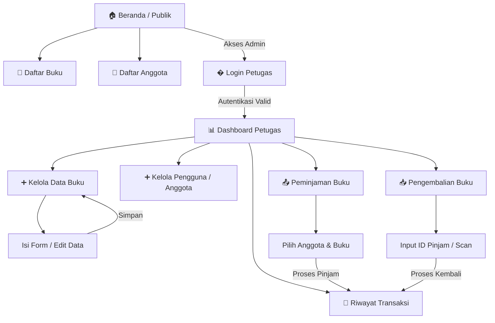

# 📚 SIMPUS-Mini - Userflow & Wireframe

Dokumen ini berisi rancangan **Userflow** (Alur Pengguna) dan **Wireframe** (Tata Letak) untuk proyek Sistem Perpustakaan Mini (SIMPUS-Mini), meliputi fitur yang sudah berjalan maupun fitur yang akan datang (Login, Dashboard Petugas, Peminjaman, Pengembalian, Riwayat).

---

## 🔄 Userflow (Keseluruhan & Fitur Mendatang)

Alur di bawah ini menggambarkan navigasi dari sistem secara menyeluruh, diawali dengan portal publik dan portal khusus petugas (Admin).



*Keterangan Fitur Mendatang:*
- **Login Petugas**: Gerbang bagi pustakawan untuk masuk ke sistem manajemen internal.
- **Dashboard Petugas**: Halaman pusat kendali petugas setelah berhasil login.
- **Peminjaman Buku**: Proses pencatatan saat anggota meminjam buku.
- **Pengembalian Buku**: Proses pencatatan anggota saat mengembalikan buku (termasuk denda jika ada).
- **Riwayat Transaksi**: Log semua aktivitas masuk-keluar buku.

---

## 🎨 Wireframes

Wireframe merupakan kerangka kasar tampilan aplikasi untuk versi **Mobile** maupun **Desktop**.

### 1. Halaman Login (Fitur Mendatang)
Halaman autentikasi untuk petugas perpustakaan.

```text
+-------------------------------------------------------------+
|  [SIMPUS-Mini]                                              |
+-------------------------------------------------------------+
|                                                             |
|       +---------------------------------------------+       |
|       |  🔑 Login Petugas                           |       |
|       |                                             |       |
|       |  [ Username / Email               ]         |       |
|       |  ----------------------------------         |       |
|       |  [ Password                       ]         |       |
|       |  ----------------------------------         |       |
|       |                                             |       |
|       |       [==== MASUK KE SISTEM ====]           |       |
|       +---------------------------------------------+       |
|                                                             |
+-------------------------------------------------------------+
```

### 2. Dashboard Petugas (Fitur Mendatang)
Panel utama admin setelah login berhasil.

```text
+-------------------------------------------------------------+
|  [SIMPUS-Mini - Admin]                   [👤 Hai, Admin] ▼  |
+-------------------------------------------------------------+
|                                                             |
|  [Menu Navigator]                                           |
|  +----------------+ +----------------+ +----------------+   |
|  | 📤 Peminjaman  | | 📥 Pengembalian| | 📜 Riwayat     |   |
|  +----------------+ +----------------+ +----------------+   |
|  +----------------+ +----------------+                      |
|  | 📖 Kelola Buku | | 👥 Kelola Agn. |                      |
|  +----------------+ +----------------+                      |
|                                                             |
|  [Pemberitahuan Terbaru]                                    |
|  - Anggota A terlambat mengembalikan buku "Web Dev".        |
|  - Stok Buku "Laskar Pelangi" sisa 1.                       |
|                                                             |
+-------------------------------------------------------------+
```

### 3. Halaman Peminjaman (Fitur Mendatang)
Formulir transaksi saat buku dipinjam.

```text
+-------------------------------------------------------------+
|  [SIMPUS-Mini - Admin]                   [👤 Hai, Admin] ▼  |
+-------------------------------------------------------------+
|  � Transaksi Peminjaman Baru                               |
|                                                             |
|  1. Data Peminjam                                           |
|  [ Pilih Anggota (Cari Nama / ID)   ▼ ]                     |
|                                                             |
|  2. Data Buku                                               |
|  [ Pilih Buku yang Tersedia         ▼ ] [+ Tambah Buku ]    |
|  - Buku: Pemrograman Web (1 Buah)                           |
|                                                             |
|  3. Keterangan Waktu                                        |
|  [ Tanggal Pinjam: 31/08/2026       ]                       |
|  [ Batas Kembali:  07/09/2026       ]                       |
|                                                             |
|  [ Batal ]  [ Proses Peminjaman ]                           |
|                                                             |
+-------------------------------------------------------------+
```

### 4. Halaman Pengembalian (Fitur Mendatang)
Halaman untuk mengonfirmasi pengembalian dan meninjau masalah/denda.

```text
+-------------------------------------------------------------+
|  [SIMPUS-Mini - Admin]                   [👤 Hai, Admin] ▼  |
+-------------------------------------------------------------+
|  📥 Transaksi Pengembalian                                  |
|                                                             |
|  [ Masukkan ID Peminjaman / Scan Barcode ] [ Cari ]         |
|                                                             |
|  *Detail Ditemukan:*                                        |
|  - Peminjam   : Bintang (AGT-01)                            |
|  - Buku       : Dasar-Dasar Algoritma                       |
|  - Tgl Pinjam : 20/08/2026                                  |
|  - Status     : TERLAMBAT (4 Hari)                          |
|  - Denda      : Rp 4.000                                    |
|                                                             |
|  [ Tandai Buku Rusak/Hilang ? ]                             |
|                                                             |
|  [ Batalkan ]  [ Konfirmasi Pengembalian ]                  |
|                                                             |
+-------------------------------------------------------------+
```

### 5. Halaman Riwayat Transaksi (Fitur Mendatang)
Tabel untuk mencetak laporan atau memantau transaksi.

```text
+-------------------------------------------------------------+
|  [SIMPUS-Mini - Admin]                   [👤 Hai, Admin] ▼  |
+-------------------------------------------------------------+
|  � Riwayat Transaksi                   [Cetak Laporan 🖨️]  |
|                                                             |
|  +----+---------+------------------+------------+--------+  |
|  | ID | Tgl     | Peminjam / Buku  | Batas      | Status |  |
|  +----+---------+------------------+------------+--------+  |
|  | 01 | 31 Aug  | Bintang / CSS    | 07 Sep     | AKTIF  |  |
|  | 02 | 20 Aug  | John / HTML      | 27 Aug     | SELESAI|  |
|  +----+---------+------------------+------------+--------+  |
|  [< Prev] Halaman 1 dari 5 [Next >]                         |
|                                                             |
+-------------------------------------------------------------+
```

### 6. Halaman Publik (Beranda & Daftar Eksisting)
Tampilan akses pengunjung umum (guest), tanpa menu pengelolaan.

```text
+-------------------------------------------------------------+
|  [SIMPUS-Mini]                    [Login Petugas] [≡ Menu]  |
+-------------------------------------------------------------+
|                                                             |
|  Selamat Datang di Sistem Perpustakaan Mini                 |
|  Aplikasi sederhana untuk mengelola data buku.              |
|                                                             |
|  [Ringkasan Publik]                                         |
|  +--------------------+  +--------------------+             |
|  | 📚 Total Buku      |  | 👥 Total Anggota   |             |
|  |        12          |  |         8          |             |
|  +--------------------+  +--------------------+             |
|                                                             |
+-------------------------------------------------------------+
```

---

> _Catatan: Desain fitur mendatang ini dirancang agar administrasi perpustakaan berpusat dalam satu Dashboard Petugas dengan visibilitas data transaksi (Peminjaman & Pengembalian) yang detail dan jelas._
