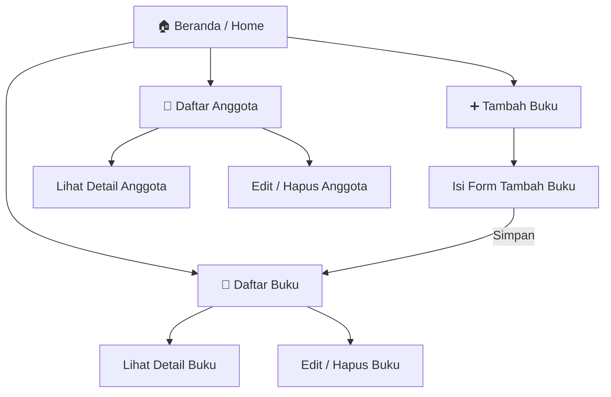

# 📚 SIMPUS-Mini - Userflow & Wireframe

Dokumen ini berisi rancangan **Userflow** (Alur Pengguna) dan **Wireframe** dasar (Tata Letak) untuk proyek Sistem Perpustakaan Mini (SIMPUS-Mini).

---

## 🔄 Userflow

Userflow menggambarkan navigasi atau alur pengguna dari halaman ke halaman yang tersedia di dalam aplikasi **SIMPUS-Mini**.



*Keterangan:*
- **Beranda**: Menampilkan ringkasan data (Total Buku, Total Anggota, Sedang Dipinjam).
- **Daftar Buku**: Menampilkan daftar koleksi buku yang tersedia.
- **Tambah Buku**: Form untuk menginputkan data buku baru ke dalam sistem.
- **Daftar Anggota**: Menampilkan daftar pengunjung/anggota perpustakaan.

---

## 🎨 Wireframes

Wireframe merupakan kerangka kasar tampilan aplikasi untuk versi **Mobile** maupun **Desktop**.

### 1. Halaman Beranda (Home)
Halaman utama saat pengguna mengakses aplikasi perpustakaan.

```text
+-------------------------------------------------------------+
|  [SIMPUS-Mini]                                     [≡ Menu] |
+-------------------------------------------------------------+
|                                                             |
|  Selamat Datang di Sistem Perpustakaan Mini                 |
|  Aplikasi sederhana untuk mengelola data buku dan anggota.  |
|                                                             |
|  [Ringkasan]                                                |
|  +--------------------+  +--------------------+             |
|  | 📚 Total Buku      |  | 👥 Total Anggota   |             |
|  |        12          |  |         8          |             |
|  +--------------------+  +--------------------+             |
|  +--------------------+                                     |
|  | 🔄 Sedang Dipinjam |                                     |
|  |        3           |                                     |
|  +--------------------+                                     |
|                                                             |
+-------------------------------------------------------------+
|  © 2026 SIMPUS-Mini — Jobsheet 3                            |
+-------------------------------------------------------------+
```

### 2. Halaman Daftar Buku (List Buku)
Menampilkan tabel daftar buku yang ada di dalam koleksi.

```text
+-------------------------------------------------------------+
|  [SIMPUS-Mini]                                     [≡ Menu] |
+-------------------------------------------------------------+
|  📖 Daftar Buku                                             |
|                                                             |
|  [+ Tambah Buku Baru]                                       |
|                                                             |
|  +----+------------------------+-------------+-----------+  |
|  | No | Judul Buku             | Pengarang   | Aksi      |  |
|  +----+------------------------+-------------+-----------+  |
|  | 1  | Laskar Pelangi         | Andrea H.   | Edit|Del  |  |
|  | 2  | Pemrograman Web        | Budi S.     | Edit|Del  |  |
|  +----+------------------------+-------------+-----------+  |
|                                                             |
+-------------------------------------------------------------+
|  © 2026 SIMPUS-Mini — Jobsheet 3                            |
+-------------------------------------------------------------+
```

### 3. Halaman Tambah Buku (Form Tambah Buku)
Form pengisian data buku baru.

```text
+-------------------------------------------------------------+
|  [SIMPUS-Mini]                                     [≡ Menu] |
+-------------------------------------------------------------+
|  ➕ Tambah Data Buku                                        |
|                                                             |
|  [ Judul Buku                       ]                       |
|  ------------------------------------                       |
|  [ Nama Pengarang                   ]                       |
|  ------------------------------------                       |
|  [ Tahun Terbit                     ]                       |
|  ------------------------------------                       |
|  [ Kategori / Genre                 ]                       |
|  ------------------------------------                       |
|                                                             |
|  [ Batal ]  [ Simpan Data ]                                 |
|                                                             |
+-------------------------------------------------------------+
|  © 2026 SIMPUS-Mini — Jobsheet 3                            |
+-------------------------------------------------------------+
```

### 4. Halaman Daftar Anggota
Menampilkan tabel anggota perpustakaan yang terdaftar.

```text
+-------------------------------------------------------------+
|  [SIMPUS-Mini]                                     [≡ Menu] |
+-------------------------------------------------------------+
|  👥 Daftar Anggota                                          |
|                                                             |
|  +----+------------------------+-------------+-----------+  |
|  | No | Nama / ID Anggota      | Status      | Aksi      |  |
|  +----+------------------------+-------------+-----------+  |
|  | 1  | AGT-01 - Bintang       | Aktif       | Edit|Del  |  |
|  | 2  | AGT-02 - John Doe      | Aktif       | Edit|Del  |  |
|  +----+------------------------+-------------+-----------+  |
|                                                             |
+-------------------------------------------------------------+
|  © 2026 SIMPUS-Mini — Jobsheet 3                            |
+-------------------------------------------------------------+
```

---

> _Catatan: Desain dioptimalkan agar responsif dengan menggunakan Flexbox/Grid sesuai _best practice_ CSS, terutama dengan pendekatan Mobile-First._
